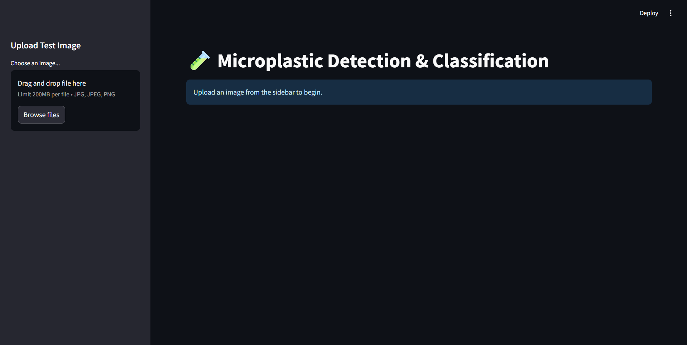
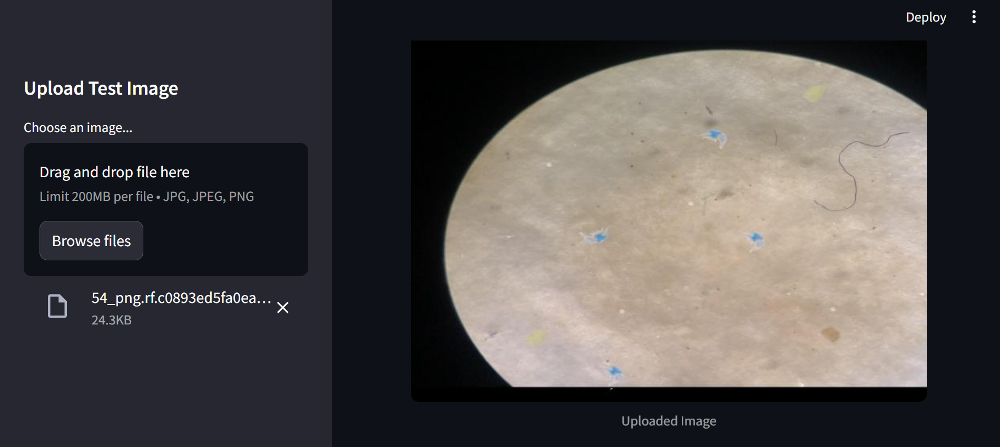
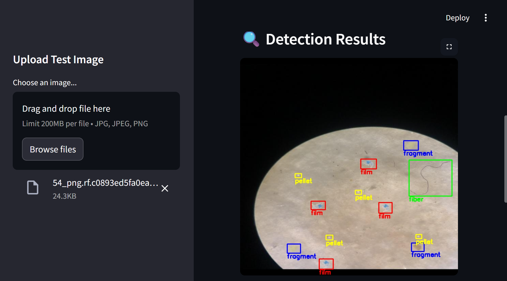
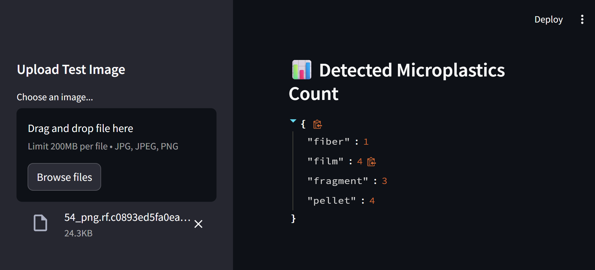

# 🧪 Microplastic Detection in Microscopic Images using YOLOv8x

<p align="center">
  
  
  
  
  
</p>

---

## 📌 Overview

Microplastic pollution has become a significant environmental concern due to its impact on aquatic ecosystems and potential risks to human health. Manual identification of microplastics under a microscope is labor-intensive and prone to inconsistencies.

This project presents an **AI-powered microplastic detection system** using **YOLOv8x** for automated detection and classification of microscopic images. A **Streamlit web application** enables users to upload microscope images and instantly visualize detected microplastics with bounding boxes and class counts.

---

## 🎯 Objectives

- Detect microplastics automatically from microscopic images.
- Classify detected particles into different categories.
- Compare YOLOv8x with Faster R-CNN.
- Deploy the trained model using Streamlit for real-time inference.

---

# ✨ Features

- ✅ Deep Learning-based Object Detection
- ✅ YOLOv8x Model
- ✅ Faster R-CNN Comparison
- ✅ Streamlit Web Application
- ✅ Automatic Object Counting
- ✅ Bounding Box Visualization
- ✅ Four Microplastic Categories
- ✅ Real-time Image Inference

---

# 📂 Dataset

Dataset Source:

- Roboflow Universe
- YOLOv8 Format

Dataset Structure

```
dataset/
│
├── train/
│   ├── images/
│   └── labels/
│
├── valid/
│   ├── images/
│   └── labels/
│
└── test/
    ├── images/
    └── labels/
```

### Classes

| ID | Class |
|----|--------|
| 0 | Fiber |
| 1 | Film |
| 2 | Fragment |
| 3 | Pellet |

---

# 🏗 Project Structure

```
Microplastic-Detection-in-Microscopic-Images/
│
├── app.py
├── data.yaml
├── requirements.txt
├── README.md
│
├── datasets/
│
├── notebooks/
│   ├── yolov8x-cv-final.ipynb
│   ├── fasterrcnn-cv-final.ipynb
│   └── yolonewdataset.ipynb
│
├── docs/
│   └── Report.pdf
│
└── screenshots/
```

---

# 🧠 Model Architecture

The project evaluates two state-of-the-art object detection models:

### YOLOv8x

- One-stage object detector
- Fast inference
- High detection accuracy
- Real-time deployment

### Faster R-CNN

- Two-stage detector
- High localization accuracy
- Used for comparison

---

# 📊 Performance Comparison

| Model | Precision | Recall | mAP@0.5 |
|--------|----------:|-------:|---------:|
| YOLOv8x | **0.926** | **0.942** | **0.918** |
| Faster R-CNN | 0.874 | 0.909 | 0.872 |

---

# 🖥 Streamlit Deployment

The Streamlit application allows users to:

- Upload microscope images
- Detect microplastics automatically
- Display bounding boxes
- Display class labels
- Display object counts

Run the application:

```bash
streamlit run app.py
```

---

# ⚙ Installation

Clone the repository

```bash
git clone https://github.com/Sivajyothis2002/Microplastic-Detection-in-Microscopic-Images.git
```

Move into the project directory

```bash
cd Microplastic-Detection-in-Microscopic-Images
```

Install dependencies

```bash
pip install -r requirements.txt
```

Run Streamlit

```bash
streamlit run app.py
```

---

# 📦 Requirements

- Python 3.10+
- PyTorch
- Ultralytics YOLOv8
- OpenCV
- Streamlit
- NumPy
- Matplotlib
- Pillow

---

# 📸 Results

The developed system successfully detects:

- Fiber
- Film
- Fragment
- Pellet

The application provides:

- Bounding Boxes
- Class Labels
- Confidence Scores
- Total Object Count

---

## 📸 Screenshots

### Home Page



### Upload Image



### Detection Result



### Detected Object Count



# 🚀 Future Work

- Improve detection accuracy for overlapping particles
- Support video inference
- Deploy using Streamlit Cloud
- Mobile application
- Multi-scale detection
- Expand dataset with additional microplastic classes

---

# 📚 Technologies Used

- Python
- YOLOv8
- Faster R-CNN
- PyTorch
- Streamlit
- OpenCV
- NumPy
- Matplotlib
- Roboflow

---

# 👩‍💻 Authors

**Siva Jyothis**

M.Tech Data Science

Amrita Vishwa Vidyapeetham

Bengaluru, India

---

# ⭐ If you found this project useful

Please consider giving it a ⭐ on GitHub.
